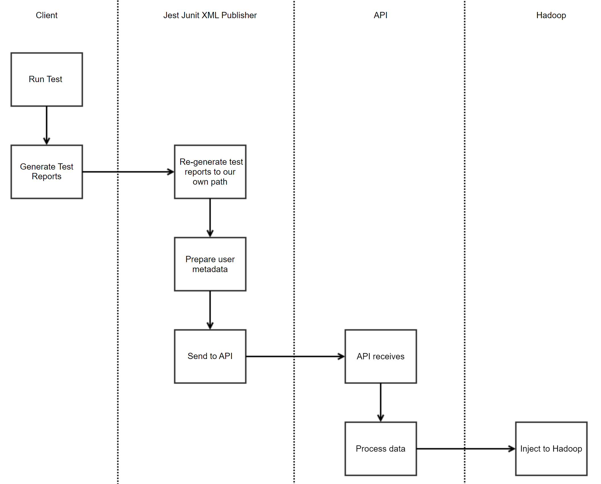

# Test Results Collector

### What is it?

An npm package that publishes test results object from testResultsProcessor(eg. jest) to an HTTP endpoint

## Objective

- We want to collect test run data from local machines (Laptops) to analyze and help improve the developer experience. We should be able to correlate this with data from CI to look for common behavior that indicates poor local experience.
- For example:
    - People not running test on their local, pushing to CI for testing
    - Specific test suites that only run on CI that people never run locally
    - Test that take a long time to run locally when compare to CI, or both CI and local are long
    - Tests that are repeatedly run on without code change to succeed, indicating flakiness (might be tricky)


### How does it work?



## Getting Started

### Usage

Firstly, client will need to install Test Results Collector package

```npm install --save-dev agoda-test-metrics```

Next, user will require to add `testResultsProcessor` key to jest config 

`testResultsProcessor: 'agoda-test-metrics'`

Note: Jest config could be in either **package.json** OR **standalone file** (jest.config.js).

#### For example,

If there is jest section in `package.json`, simply add:
```{
  "name": "my-project",
  "jest": {
    "testResultsProcessor": "agoda-test-metrics",
  }
}
```
or if there is `jest.config.js`, simply add: 

```"testResultsProcessor": "agoda-test-metrics"```

## API

After include the package in your project, everytime when you run the test in local, the plugin will collect required data

1. User's metadata 

| Metadata          | Data Type |
|-------------------|---------|
|branch| STRING  |
|projectName| STRING  |
|repository| STRING  |
|repositoryName| STRING  |
|hostname| STRING        |
|username| STRING  |
|os| STRING  |
|osVersion| STRING  |
|gitCommitDate| STRING  |
|gitHeadCommit| STRING  |
|testRunner| STRING  |
|testRunnerVersion| STRING  |
|cpuCount| NUMBER  |

2.  Test Results (See [Test Results Schema](https://github.com/jestjs/jest/blob/6460335f88cee3dcb9d29c49d55ab02b9d83f994/packages/jest-test-result/src/types.ts))


Then, it will post to [API]

### Configuration

You can define an endpoint in the environment variable and the stats data will be sent there via HTTP POST Request

| Environment Variable | Default Value |
|----------|---------------|
|JEST_TESTDATA_API_URL|http://your_api_domain/jest|


## Test Data Schema

After that, the data will be processed on API (and then this can be able to inject to Hadoop if you want to analyze later)


## Development

For testing, the idea is you can publish the beta version in the `release-beta` job on CI, and install the desired version to your repository using following command

` npm install agoda-test-metrics@<<beta version>> --force`

if the version is not updated, delete node_modules folder and reinstall

## Publish 

The idea is you can publish the new version using `release` job on CI. 

## for playwright
please read doc/PLAYWRIGHT.md

## for vitest 
please read doc/VITEST.md
