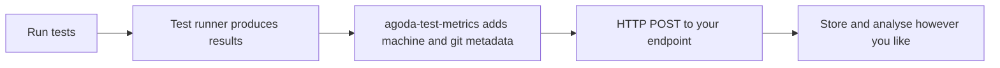

# agoda-test-metrics: Find Out What Your Tests Are Really Doing

An npm package that collects test run data from developer machines and CI, and posts it to an HTTP endpoint of your choosing. It supports:

- Jest (24.x to 30.x)
- Playwright
- Vitest

It is part of the same family as [agoda-devfeedback](https://github.com/agoda-com/devfeedback-js), which does the same job for build times.

## Why Collect Local Test Data?

CI tells you how your tests behave on a build agent. It tells you nothing about what happens on a laptop, which is where developers spend their day. This is part of the [F5 Experience](https://beerandserversdontmix.com/2024/08/15/an-introduction-to-the-f5-experience/): setup should be easy and the feedback loop should be fast.

Once you have local and CI data side by side, you can look for patterns like:

- People not running tests locally and pushing to CI to find out if they pass
- Test suites that only ever run on CI
- Tests that take much longer locally than on CI, or that are slow in both
- Tests that are re-run without a code change until they pass, which points to flakiness

## How It Works


```mermaid
flowchart LR
    A[Run tests] --> B[Test runner produces results]
    B --> C[agoda-test-metrics adds machine and git metadata]
    C --> D[HTTP POST to your endpoint]
    D --> E[Store and analyse however you like]
```

The package only sends data. What receives it is up to you: anything that accepts an HTTP POST will do.

## Consuming the Data

The data is sent to the following default endpoints (customizable via environment variable):

| Test Runner | Default                                       | Environment Variable Override | Format                                                  |
| ----------- | --------------------------------------------- | ----------------------------- | ------------------------------------------------------- |
| Jest        | "<http://compilation-metrics/jest>"           | BUILD_METRICS_ES_ENDPOINT     | JSON                                                    |
| Playwright  | "<http://compilation-metrics/testdata/junit>" | BUILD_METRICS_ES_ENDPOINT     | `multipart/form-data`, metadata fields plus a JUnit XML |
| Vitest      | "<http://compilation-metrics/vitest>"         | BUILD_METRICS_ES_ENDPOINT     | JSON                                                    |

`BUILD_METRICS_ES_ENDPOINT` is the same override the other libraries in the family use. It replaces the whole URL, not just the host.

Pro tip: set up a CNAME on your internal DNS for `compilation-metrics` and nobody has to configure anything. The same host name is the default for the other libraries in the family, so one DNS entry covers all of them.

A failed POST never fails your test run. The error is logged and the run carries on.

## Getting Started

```bash
npm install --save-dev agoda-test-metrics
```

### Jest

Add the `testResultsProcessor` key to your Jest config, in `jest.config.js`:

```javascript
module.exports = {
  // ... your other config ...
  testResultsProcessor: 'agoda-test-metrics',
};
```

or in `package.json`:

```json
{
  "name": "my-project",
  "jest": {
    "testResultsProcessor": "agoda-test-metrics"
  }
}
```

### Playwright

See [doc/PLAYWRIGHT.md](doc/PLAYWRIGHT.md).

### Vitest

See [doc/VITEST.md](doc/VITEST.md).

## What Gets Sent

Every payload carries metadata about the machine and the repository:

| Metadata          | Data Type | Notes                                         |
| ----------------- | --------- | --------------------------------------------- |
| id                | STRING    | CI job id on GitLab or GitHub, otherwise a UUID |
| branch            | STRING    |                                               |
| projectName       | STRING    |                                               |
| repository        | STRING    | Credentials are stripped from the URL         |
| repositoryName    | STRING    |                                               |
| hostname          | STRING    |                                               |
| username          | STRING    | CI user on GitLab or GitHub, otherwise the OS user |
| os                | STRING    |                                               |
| osVersion         | STRING    |                                               |
| gitCommitDate     | STRING    |                                               |
| gitHeadCommit     | STRING    |                                               |
| testRunner        | STRING    |                                               |
| testRunnerVersion | STRING    |                                               |
| cpuCount          | NUMBER    |                                               |

Plus the test results themselves:

- **Jest**: the results object Jest hands to a `testResultsProcessor`, as `testCaseSummary`. See the [Jest test result types](https://github.com/jestjs/jest/blob/6460335f88cee3dcb9d29c49d55ab02b9d83f994/packages/jest-test-result/src/types.ts).
- **Playwright**: the JUnit XML file written by Playwright's `junit` reporter, attached as `files`.
- **Vitest**: per-file and per-test-case timings and statuses. See [src/vitest/types.ts](src/vitest/types.ts).

Heads up: the payload includes the hostname and username of whoever ran the tests. Tell your developers before you roll it out.

## Development

```bash
npm ci
npm run build
npm test
```

To try a change in another repository before releasing it, build a tarball and install that:

```bash
npm pack
# then, in the consuming repository
npm install --save-dev /path/to/agoda-test-metrics-<version>.tgz
```

If the change does not show up, delete `node_modules` and install again.

## Publishing

Bump the version in `package.json`, merge to `master`, then create a GitHub release. The release triggers the workflow that publishes to npm.

## Contributing

Bug fixes, documentation and support for more test runners are all welcome. Open an issue or a pull request.
